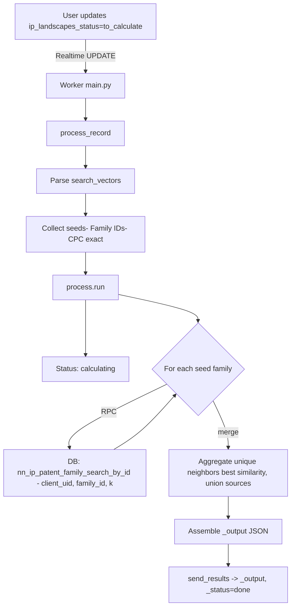

# Patent Landscape Worker

This directory contains the production pipeline for generating patent landscapes from seed inputs. The worker listens to Supabase Realtime updates on `ip_landscapes` and writes visualization data to the `_output` column.

## Flow Overview



## Key Components

- `main.py`
  - Subscribes to Realtime updates on `ip_landscapes` with filter `_status=eq.to_calculate`.
  - For each update, calls `process_record`, handles errors, and writes `_output` and statuses via Supabase SDK.

- `process.py`
  - `parse(data)`: Pydantic model validation of `search_vectors` JSON. Supports:
    - `seed_patents` with `seeds.patentFamilyIds` and optional `k`.
    - `cpc` with `classes[].code` (exact match only in v1).
  - `run(uid, client_uid, search_vectors, supabase, status_cb)`: Orchestrates the v1 pipeline using nearest-neighbor search by family id.
    - Collects seed family IDs from nodes (and CPC exact code reverse lookup).
    - For each seed, calls RPC `nn_ip_patent_family_search_by_id` and merges results.
    - Emits status updates along the way.
    - Returns a compact `_output` object with neighbors and metadata.

## Database Expectations

The following objects must exist in your database (see `landscape/db.sql`):

- Table: `export_embeddings(docdb_family_id int, embedding vector(1024))` with HNSW index for `vector_cosine_ops`.
- View: `ip_patent_families` providing family metadata.
- RPC: `nn_ip_patent_family_search_by_id(c_uid uuid, p_id integer, k integer default 10)` returning:
  - `patent_family_id text`, `title text`, `abstract text`, `family_authorities varchar[]`,
  - `first_application_pub_date date`, `similarity double precision`,
  - `sonar_is_active boolean`, `lists json[]`.

Optional (fallback from earlier MVP): `match_export_embeddings(query_embedding vector(1024), match_count int)`.

## `_output` Format (v1)

```json
{
  "v": 1,
  "mode": "neighbors_by_id",
  "seed_count": 3,
  "neighbor_count": 200,
  "neighbors": [
    {
      "family_id": "1234567",
      "similarity": 0.87,
      "title": "...",
      "abstract": "...",
      "family_authorities": ["EP", "US"],
      "first_application_pub_date": "2019-05-22",
      "sonar_is_active": false,
      "lists": [{"name": "Watchlist A", "list_uid": "..."}],
      "source_seeds": [1111111, 2222222]
    }
  ]
}
```

## Status Updates

The worker writes `_status`, `_progress`, and `_message` to keep users informed:
- parsing (5%), seeds collected (15%), NN search (30%), aggregated (80%), assembled (90%), done (100%).

## Configuration

- Environment: `SUPABASE_URL`, `SUPABASE_KEY` for the worker.
- Realtime channel/table: `ip_landscapes` (default).

