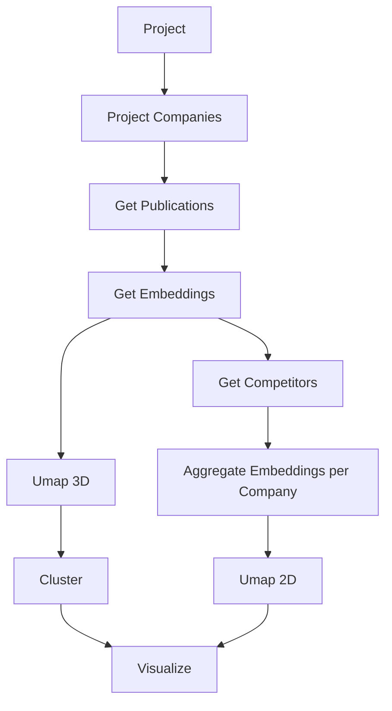

# Patent Portfolio Project Study

Author: Sebastian Erhardt


## Process


```mermaid
flowchart TB
    Project --> PC[Project Companies]
    PC --> Pubs[Get Publications]
    Pubs --> Emb[Get Embeddings]
    Emb --> Comp[Get Competitors]
    Emb --> 3D[Umap 3D]
    3D --> Cluster[Cluster]
    Cluster --> Vis[Visualize]
    Comp --> Agg[Aggregate Embeddings per Company]
    Agg --> 2D[Umap 2D]
    2D --> Vis
```


# Build Requirements

```bash
pipreqs --force .
```